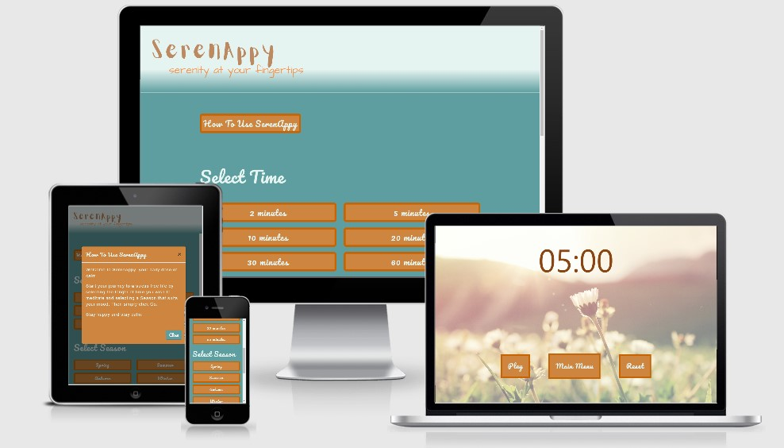

# SerenAppy - A Meditation Web App 

A live demo can be found [here](https://gmanprodev.github.io/SerenAppy-Web-App/)

## Introduction

SerenAppy is a meditation web app which has been built for a local community Health & Wellbeing centre. It will be used during meditation sessions in conjunction with yoga classes.

It presents a landing page with options for how long the user wishes to meditate for (time) and what visual and audio experience the user prefers (season). The user can select from the following options:
### Time
* 2 minutes
* 5 minutes
* 10 minutes
* 20 minutes 
* 30 minutes
* 60 minutes

### Season
* Spring
* Summer
* Autumn
* Winter

The time selection sets how long the video and audio will last before it stops and the season selection will set the video and audio that the user would associate with the season chosen.

If only one selection is made the user will see an alert box prompting them to choose a time and season option.

The main purpose of the web app is to allow public funded health & well being initiatives and bodies to access an easy to use meditation tool for people from all walks of life.

The web app can be viewed on Desktop, Tablet and Mobile devices.

## Table of Content

1. [UX](#ux)
    * [Goals](#goals)
        * [SerenAppy goals](#serenappy-goals)
        * [Business goals](#business-goals)
        * [Customer goals](#customer-goals)
    * [User Stories](#user-stories)
        * [Local Health and Well-being Centre](#local-health-and-well-being-centre)
        * [The potential customer](#the-potential-customer)
         * [The UX designer](#the-ux-designer)
    * [Minimum Viable Product](#minimum-viable-product)
    * [Design](#design)
        * [Colors](#colors)
        * [Font](#font)
    * [Wireframes](#wireframes)
2. [Features](#features)
    * [Existing Features](#existing-features)
        * [Elements seen on the landing page](#elements-seen-on-the-landing-page)
        * [Elements seen on the 404 page](#elements-seen-on-the-404-page)
        * [Elements seen on all meditation pages](#elements-seen-on-all-meditation-pages)
    * [Features left to implement](#features-left-to-implement)
    * [Bugs and Fixes for Future Releases After Testing](#bugs-and-fixes-for-future-releases-after-testing)
3. [Technologies Used](#technologies-used)
4. [Testing](#testing)
5. [Deployment](#deployment)
    * [Hosting on GitHub Pages](#hosting-on-github-pages)
    * [How to run this project locally](#how-to-run-this-project-locally)
6. [Credits](#credits)
    * [Media](#media)
    * [Acknowledgements](#acknowledgements)
        * [Examples and Tutorials and Samples](#examples-and-tutorials-and-samples)
        * [Pages used for information](#pages-used-for-information)
        * [I received advice and encouragement from](#i-received-advice-and-encouragement-from)
7. [Disclaimer](#disclaimer)

## UX

### Goals

#### SerenAppy goals

The goal of this web app is to allow public funded health & well being initiatives and bodies to access an easy to use mediataion tool for people from all walks of life.

**Target audience is:**

* People who are passionate about mental and physical wellbeing.
* Publically funded organisations who promote mental and physical health.
* People who are struggling with any kind of anxiety.
* Participants of yoga and general mindfulness excerise classes. 
* Any age group.
 

#### Business goals

* To have as many of the attendees of the Health and Well-being centre, as possible, take up usage of the web app.
* Interactive web-app.
* Fully functional web app.
* Intuitive design.
* Easy to navigate.

#### Customer goals

* Meditation
* Reducing stress and anxiety.
* Helpful tool during exercise and mental health classes.

Both business and customer goals are addressed through user stories.

### User Stories

#### Local Health and Well-being Centre

* As a Well-being centre, I want my web app to display calm natural colours.
* As a Well-being centre, I want my web app to display simple to follow instructions.
* As a Well-being centre, I want my web app to be responsive on all devices.
* As a Well-being centre, I want a strong focus on mobile usability as most users will be veiwing the web app on mobile devices.
* As a Well-being centre, I want my web app to be interactive and offer real time feedback.
* As a Well-being centre, I want to be able to receive feedback and messages from users.
* As a Well-being centre, I want my web app to load quickly.
* As a Well-being centre, I want my web app to use as little of the users data as possible.
* As a Well-being centre, I want my web app to allow users to engage with us through different social media routes.
* As a Well-being centre, I want my web app to display easy to use audio and timer function controls.
* As a Well-being centre, I want my web app to display clear high resolution images.
* As a Well-being centre, I want my web app to be usable for both left and right handed users.
* As a Well-being centre, I want my web app to have a low risk of accidently clicking more than one button at once on smaller screens sizes.

#### The potential customer

* As a customer, I want to know how the web app works and easy to follow instructions.
* As a customer, I want to know when I take the wrong action or something doesn't work.
* As a customer, I want the web app to be interactive with real time feedback.
* As a customer, I want the the web app to be easy to use and navigate, particularly on mobile devices.
* As a customer, I want to be able to easily get back to the main page, pause or rest the audio and timer if I'm distracted.
* As a customer, I want to be able to contact the well-being centre via email and social media platforms.
* As a customer, I want to be able to listen to my own choice of audio.
* As a customer, I want the web app to be available in different languages.
* As a customer, I want the web app to have built in volume controls.

#### The UX designer

* As a UX designer, I want to track the user behaviour so that I can improve the user experience.
    * As a UX designer, I want to track the user behaviour so that I can identify the possible user confusion over navigating the web app.
    * As a UX designer, I want to find which Time and Season selection buttons are used the least by users so that the options can be updated if needed.
* As a UX designer, I want to focus on the mobile design as most users will be using the web app on a mobile device.
* As a UX designer, I want the web app to be intercative and give real time feedback when a user executes an action.
  

### Minimum Viable Product

All the User Stories have been assessed against value and complexity on the chart below. Due to the relatively short time for the implementation of the web app, only the MVPs will be implemented in the first release of the web app.

[User Stories evaluation](documentation/mvp/user_stories.md)

**Explanation of the chart**

* The top area of the chart has been given the higher priority of implementation because it represents the most important features including:
  * Colour scheme and design.
  * Simple to follow instructions
  * Intercative and showing real time feedback to the user.
  * Easy to use audio and timer function controls.
  * Allowing users to interact with the supplier.
  * Responsive Web app.
* I have addressed all of the high value and high/low complexity in the first release.
* The features with high complexity and low value have been postponed for future updates/releases.

### Design

#### Colors

Following colours have been used:
*  #CD853F (Peru) 
*  #C76302 (Tawny) 
*  #D2B48C (Tan) 
*  #5f9ea0 (Cadet Blue) 
*  #8B4513 (Saddle Brown)    
*  #6c757d (Light Grey) 
*  #E6F4F1 (Clear Day) 

The stand out colour for this web page is Cadet Blue, which according to [Color Psychology](https://www.colorpsychology.org/teal/) is associated with the ocean and nature. This concept is very relevant for a web app associated with meditation and seeking to create a relaxed state of mind.

Other than Cadet Blue, I used Peru for all of the buttons which have a Tawny border and when hovered on the button colour changes to Tan and the text changes to Saddle Brown. For the header and footer text I have used Tawny. For the Time and Season titles, all of the button text and the form text boxes I have used the colour Clear Day. When you hover on the media icons and the text links in the footer they change to Cadet Blue. Both the header and footer have a colour gradient applied which blends the colours Cadet Blue and Clear Day. All modals have Peru as their background colour, Clear Day for all text, boxes and Cadet Blue for buttons and the button `hover` and clicked changes the colour to Raven. The countdown timer on each meditation page is represented with numbers using the colour Saddle Brown. I have two sweet alert pop ups to confirm the users actions, these pop ups have their own default colours.

#### Font

The Fonts I used for this project are **Pacifico** and **Sans Serif** with the font weights: 
* 400 - for all button text and subtext.
* 500 - for headers and titles.

The [Pacifico](https://fonts.google.com/specimen/Pacifico) font was chosen for its soft calming design.

### Wireframes

I decided that it would be more helpful to have mockups than simple wireframes. The mockups were built in [figma](https://www.figma.com/). 

Link to the mockups can be found [here](https://www.figma.com/file/ld7rwps08gZCxYCipi7M3o/SerenAppy?node-id=0%3A1). The mockups were designed for the mobile first approach. I have produced a desktop and mobile mockup of the landing page. For the meditation pages I have only produced mobile mockups as the layout will remain the same on all screen sizes.

If you are unable to access the mockup links above please see the mockup images [here](https://github.com/Gmanprodev/SerenAppy-Web-App/tree/master/documentation/wireframes).

## Features

### Existing Features

#### Elements seen on the landing page.

* **Layout and Style**
    * I wanted the web app to have an appearance that was associated with natural elements, such as water, wood and the sky. My aim was to provide users with an instant sense of calm as soon as the web app had loaded, with the colour scheme and fonts used I believe I have been able to achieve this. Given this site is a web app and is purely there to interact with the users senses, I wanted to keep the text elements as simple as possible by limiting the amount of text that is used. The layout is a basic use of columns and rows which keeps the buttons in a consistent grid format that changes from multiple columns on larger screens to one column on smaller screens.

* **Navigation bar**
    * Has a `fixed` position on screen heights greater than 580px, to ensure that the logo can always be seen by the user, and a `absolute` postion on screen heights less than 580px to ensure there is enough content on the screen at any one time.
    * A SerenAppy logo in the left corner which also serves as a link to resfresh the landing page. The logo remains the same on all screen sizes.
    * The navbar background colour has ben built using a CSS gradient scheme to seamlessly move from one colour into another.

* **Footer**
    * Copyright information.
    * Web app built by information (linked to Marc Gulliver Linkedin profile).
    * Web app address (linked to web app landing page).
    * Social media links - facebook, Twitter, Instagram and Youtube (linked to relevant login page).
    * @ icon linked to an emailjs contact form modal.
    * All footer text and icons are displayed in the colour Tawny and change to Cadet Blue when on `hover` and clicked.

* **How To Use SerenAppy Button**
    * This button displays in the colour Peru with the text displaying in the colour Clear Day, the button changes to the colour Tan and the text changes to Saddle Brown when on `hover`. This button opens a pop up modal which has written instructions on how to use the web app.

* **Select Time Buttons**
    * The buttons are presented in two columns beneath the heading "Select Time", the two columns reduce to one column on screen sizes less than 768px. The "Select Time" header is displayed in the colour Clear Day. Each button is displayed in the colour Peru, border colour Tawny, text displaying in the colour Clear Day, the button changes to the colour Tan and the text changes to Saddle Brown when on `hover`. There are six "Select Time" buttons, each represents a set number of minutes (2, 5, 10, 20, 30, 60). The selected time is passed through to the meditation page using Javascript and displays as a countdown timer. The user can only select one button at a time.

* **Select Season Buttons**
    * The buttons are presented in two columns beneath the heading "Select Season", the two columns reduce to one column on screen sizes less than 768px. The "Select Season" header is displayed in the colour Clear Day. Each button is displayed in the colour Peru, border colour Tawny, the text displaying in the colour Clear Day, the button changes to the colour Tan and the text changes to Saddle Brown when on `hover`. There are four "Select Season" buttons, each represents a season (spring, summer, autumn, winter). The selected season is passed through to the meditation page using Javascript and displays the associated image and audio. The user can only select one button at a time.

* **GO Button**
    * This button is round and centred at the bottom of the page. The button is displayed in the colour Peru, border colour Tawny, the text displaying in the colour Clear Day, the button changes to the colour Tan and the text changes to Saddle Brown when on `hover`. The Go button combines the time and the season selected and uses Javascript to create and display the meditation page for the user. If only one selection is made or no selections are made the user will see a Sweet Alert pop up modal which displays "Error" and explains what steps need to be taken.

* **Hidden Pages**
    * To increase the loading speed and reduce the users data usage the web app operates from a single html file (landing page). In the index.html file there is a `div` which holds all of the meditation page information and is hidden when the landing page loads. The information in this hidden `div` is replaced with the asscoiated image, audio and time based on the users selections, using Javascript. When the GO button is clicked the entire landing page is hidden and replaced with the meditation page using Javascript. 

* **How To Use SerenAppy - Modal**
    * The modal takes up 80% of the page and is displayed in the centre of the page. The modal has a background colour of Peru, all text is the colour Clear Day and the button is Cadet Blue which changes to a light grey colour when on `hover` and when clicked. The modal has two ways of closing, either click the close button in the bottom right corner or click the `x` in the top right corner. 

* **Contact Form - Modal**
    * The modal takes up 80% of the page and is displayed in the centre of the page. The modal has a background colour of Peru, all text is the colour Clear Day, the field boxes have a Cadet Blue border, the field box text is black and the submit button is Cadet Blue which changes to a light grey colour when on `hover` and when clicked. You can close the modal by clicking the `x` in the top right corner. You can submit the form by clicking the submit button, which is centred, at the bottom of the modal. All fields are validated so users can't submit the form with empty fields, also the email address is validated by using the `pattern` attribute within the html code which determines if the email format is correct or not. After clicking the submit button, with all fields correctly filled out, the user will see a Sweet Alert modal pop up informing the user of whether the email has been successfully sent or not. If all fields have been correctly filled out, when the submit button is clicked the fields are cleared and reset.

* **Favicon**
    * I installed Favicon scripts so that when the web app loads the user sees the S logo next to the SerenAppy name at the top of the browser tab.

#### Elements seen on the 404 page.

* **Layout and Style**
    * Used the same colour scheme as the modals. Background colour of Peru, all the text is the colour Clear Day and the button which returns the user to the landing page is Cadet Blue which changes to light grey when on `hover` and clicked.

* **Favicon**
    * I installed Favicon scripts so that when the web app loads the user sees the S logo next to the SerenAppy name at the top of the browser tab.

#### Elements seen on all meditation pages.

* **Background Image**
    * A full screen background image is displayed, the image shown is linked to which season the user has selected. The image has an opacity of 0.6 so that the elements on top of the image are clearly defined.

* **Countdown Timer**
    * The timer displays in the format of 00:00 in the colour of Saddle Brown. Dependent on which time button the user has clicked, this time will be passed into the meditation page using Javascript and displayed in the top half of the screen. The time display can be moved up or down within the top half of the screen by the user on mobile devices, using touch scroll, depending on the users preference as to the best position. When the countdown timer gets to zero the audio stops, a chime sound indicates the session has finished and the timer is reset with the play/pause button resetting to play. 

* **Play/Pause Button**
    * The button styling mirrors the landing page, so the button is displayed in the colour Peru, border colour Tawny, the text displaying in the colour Clear Day, the button changes to the colour Tan and the text changes to Saddle Brown when on `hover`. This button is connected to the audio and the countdown timer using Javascript, when the meditation page loads the button text is displayed as "Play". When the user clicks the play button the audio starts playing and the timer starts counting down in tandem, the button text changes to "Pause" to indicate to the user that this button can now be used to pause the audio and timer.

* **Reset Button**
    * The button styling mirrors the landing page, so the button is displayed in the colour Peru, border colour Tawny, the text displaying in the colour Clear Day, the button changes to the colour Tan and the text changes to Saddle Brown when on `hover`. This button is connected to the audio and the timer using Javascript, when the user clicks the reset button the audio stops, the timer goes back to displaying the original time selected amd the play/pause button displays the text "Play". The user can then click the play button to start the session again.

* **Main Menu Button**
    * The button styling mirrors the landing page, so the button is displayed in the colour Peru, border colour Tawny, the text displaying in the colour Clear Day, the button changes to the colour Tan and the text changes to Saddle Brown when on `hover`. This button is linked to the landing page address so that if the user wishes to return to the landing page upon finishing their meditation session or wishes to change their time or season selections they can do so with ease. On larger width screens the main menu button appears in the middle between the play/pause button and the reset button, on smaller width screens sizes the main menu button drops down below the other two buttons.

* **Favicon**
    * I installed Favicon scripts so that when the web app loads the user sees the S logo next to the SerenAppy name at the top of the browser tab.

### Features left to implement

* **Audio Library API** - To enable potential users to choose from a much wider variety of audio options.
* **Different Languages** - To enable potential users to select from a list of languages and have the web app display using the selected language. This would allow the web app to be used globally.
* **Built In Volume Controls** - To enable potential users to control the audio volume within the web app. At the moment the volume is controlled by the devices volumes settings.
* **Tracking User Behaviour** - Use an analytics tool such as [Hotjar](https://www.hotjar.com/) to view user behaviour.
* **Most and Least Visited Pages on the Site** - Use an analytics tool such as [Hotjar](https://www.hotjar.com/) to understand where the traffic is going on the site.

### Bugs and Fixes for Future Releases After Testing
 
* **Colour Contrasts** - The Lighthouse Audit Chrome extension highlighted that there are improvements needed on colour contrast, performance on the time it takes for the site to load and become interactive. These issues will be addressed in the next release.
* **Website Address in Footer** - The website address for SerenAppy does not currently exist and does not link to another page. This will be addressed in the next release.
* **Social Media Links in Footer** - The social media icons are linked to the correct pages, however these are currently generic login pages. These will direct you to the company specific pages in future releases.
* **Audio Quality** - Although the sound quality is pretty good the length of the audio files mean that there are too many stop and start points whilst the audio is playing. This leads to a disturbance for the user during their meditation sessions. These audio files will be updated in future releases.
* **Heade Size** - Reduce the size of the header (navbar) on smaller screen heights (laptops) so that more content can fit on the page - this will be implemented in future releases as the majority of users will be viewing the web app on a mobile device.
* **Background Images** - On big screen sizes the background image on the meditation pages becomes larger than the screen and some of the image is cut off. However this isn't very noticable and the images remain defined and clear - this will be implemented in future releases as the majority of users will be viewing the web app on a mobile device.
* **Confirmation Email** - Using emailjs to also send an email to the user to confirm their email has been received - this will be implemented in future releases as the user alreday gets a pop up informing them that the email has successfully been sent - this will be implemented in future releases.
* **Auto Close Contact Form Modal** - When the success pop up appears after submitting the contact form, the contact form should automatically close down - 

## Technologies Used

### Languages

* HTML - base language for this project.
* CSS - used for styling the HTML code.
* JavaScript - used to make the web app interactive.

### Libraries

* [Bootstrap](https://getbootstrap.com/) - used for responsive grid system, styling and modals.
* [JQuery](https://jquery.com/) & [Popper](https://popper.js.org/) - were used in conjunction with the Bootstrap library and Javascript.
* [FontAwseome](https://fontawesome.com/) - used for all icons on the site.
* [Google Fonts](https://fonts.google.com/) - used for the Pacifico fonts.
* [Hover.css](https://ianlunn.github.io/Hover/) - used to animate the social media icons.
* [Unsplash](https://unsplash.com/) - used for all images.
* [Sweetalert](https://sweetalert2.github.io/) - used for "Success" and "Error" pop ups in conjuction with the GO button on the landing page and the Emailjs contact form.
* [Zapsplat](https://www.zapsplat.com/) - used for audio files and sound effects.
* [Favicon.io](https://favicon.io/) - used for creating a favicon.

### API

* [Emailjs](https://www.emailjs.com/) - used to send the contact form in an email format to my gmail account.

### Tools

* [Gitpod](https://www.gitpod.io) - used as IDE for this project.
* [Git](https://git-scm.com/) - used for version control.
* [Github](https://github.com/) - used to host repository and live website.
* [Figma](https://www.figma.com/) - used for creation of mockups.
* [Am I Responsive](http://ami.responsivedesign.is/) - used for testing purposes as well as creating the image to display the web pages on different devices.
* [Google Chrome DevTools](https://developers.google.com/web/tools/chrome-devtools) - used for testing and debugging.
* [PageSpeed insights](https://developers.google.com/speed/pagespeed/insights/) - used for testing the loading speed of the site.
* [Lighthouse Audit](https://developers.google.com/web/tools/lighthouse) - used to test whether the site meets the standards expected.
* [w3 html validator](https://validator.w3.org/) - used to test and validate my html code.
* [w3 css validator](https://jigsaw.w3.org/) - used to test and validate my css code.
* [Free Formatter](https://www.freeformatter.com/) - used to format my html, css and javascript code.
* [Browserstack](https://www.browserstack.com/) - used to test my site on different browsers.
* [Color Scheme Designer](http://colorschemedesigner.com/) - used to test colour combinations.
* [CSS Gradient](https://cssgradient.io/) - used to build the colour gradient in the header and footer.
* [Canva](https://www.canva.com/) - used to create the SerenAppy logo.
* [GIMP](https://www.gimp.org/) - used this software to give my logo and favicon a transparent background.
* [jshint](https://jshint.com/) - used to validate my Javascript code.

## Testing

Testing information can be found [here](documentation/testing/testing.md).

## Deployment

This web app was developed in Gitpod and pushed to the remote repository, GitHub. The live page is hosted on GitHub Pages. 

**Used commands during deployment:**
* `git add .` - to add the files to the staging area.
* `git commit -m "text message here"` - to commit the files.
* `git push` - to push to origin master branch on to GitHub.
* `git status` - to see the current status of the files.

### Hosting on GitHub Pages

* Log into GitHub.
* From the list of repositories choose [SerenAppy](https://github.com/Gmanprodev/SerenAppy-Web-App).
* Go to settings.
* Scroll down to GitHub Pages section.
* Select as a source **master branch**.
* The page is now automatically refreshed and the project is deployed.
* To access the project scroll down again to GitHub Pages section and click on the provided link.

For more detailed information regarding deployment to GitHub Pages click [here](https://pages.github.com/).

### How to run this project locally

**Clone this project from GitHub:**

* Go to [SerenAppy](https://github.com/Gmanprodev/SerenAppy-Web-App) GitHub repository.
* Click on "Clone or download" green button.
* Copy the URL to the repository.
* Open the terminal in your IDE.
* Choose the working directory where you would like to have the cloned repository.
* Type git clone, and add the URL you copied from Github: `git clone https://github.com/Gmanprodev/SerenAppy-Web-App.git`
* Press Enter and your local clone will be created.

For more information regarding cloning of a repository click [here](https://help.github.com/en/github/creating-cloning-and-archiving-repositories/cloning-a-repository).

## Credits

### Content

All content in this web app was written by me.

### Media

**All Images & Audio**
   * All of the images used in the web app are free and do not require permission to use.
   * All of the audio and sounds used in the web app are free and do not require permission to use.

### Acknowledgements

#### Examples and Tutorials and Samples

* [Code Institute](https://codeinstitute.net/) - I used the tutorials on Jasmine and Emailjs to build the relevant code.
* [Meditation App Tutorial](https://www.youtube.com/watch?v=oMBXdZzYqEk) - used to undertsand how the javascript countdown timer functions work.
   

#### Pages used for information

* [W3schools](https://www.w3schools.com/)
* [W3C](https://www.w3.org/)
* [Stack overflow](https://stackoverflow.com/)
* [CSS-Tricks](https://css-tricks.com/)
* [MDN web docs](https://developer.mozilla.org/)
* [Codepen](https://codepen.io/)

#### I received advice and encouragement from
   * Seun Owonikoko (my mentor)
   * Tutor Support (CI online webchat)
   * SuzanneNL (fellow student)
   * Anthony (fellow student)
   * Malia (fellow student)
   * Neringa (fellow student)

## Disclaimer

**This web page was created for educational purposes only.** 